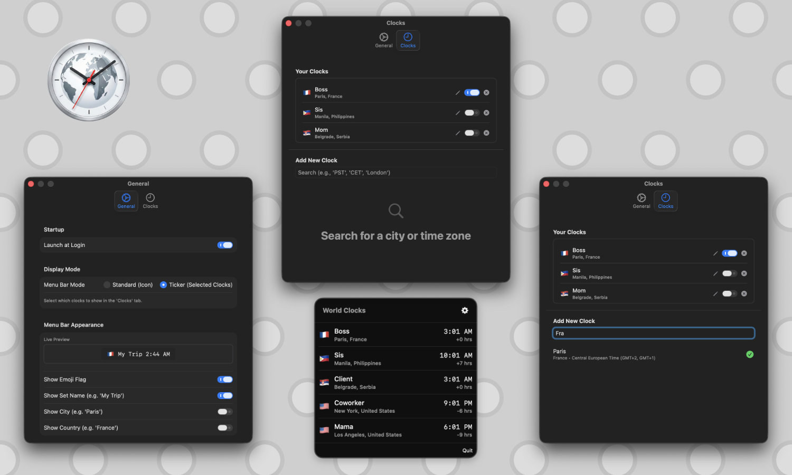

# Tymz

A native Menu Bar World Clock for macOS

Price: $0+ (Pay what you want)

Stop Googling "time in London, time in Tokyo, time in Chicago..."

**Tymz** is a native, lightweight macOS utility that lives exclusively in your menu bar. Whether you are working with a remote team, coordinating with international clients, or keeping track of family abroad, seeing their time should be instant—not a browser search away.

Designed to feel right at home on macOS, it offers a clean, native aesthetic that doesn't clutter your dock.

Key Features

Ticker Mode: Display your most important time zones directly in your menu bar (e.g., "🇫🇷 Paris 2:00 PM | 🇯🇵 Tokyo 10:00 PM").

- Instant Access: Click the icon to see a full list of your saved clocks with automatic time difference calculations (e.g., "+6 hrs").
- Smart Search: Easily find cities by name or country (e.g., search "Japan" to find "Tokyo"). 
- Emoji Flags: Beautiful, accurate flag emojis for every country.
- Native Performance: Built with SwiftUI for macOS 13+. Uses zero CPU when idle.
- Efficient: Lives only in the menu bar—no annoying Dock icon.

System Requirements

- macOS 14.6 (Sonoma) or later.
- Apple Silicon (from M1 to M5) or Intel Mac.

⚠️ Installation Note

This app is signed with an Ad-Hoc certificate (Independent Developer).

When you first open the app, you must follow these steps:

1. Move the app to your Applications folder.

2. Right-Click (or Control-Click) the app icon and select Open.

3. Click "Open" in the popup dialog.

(You only need to do this once, when you first try to run the app).